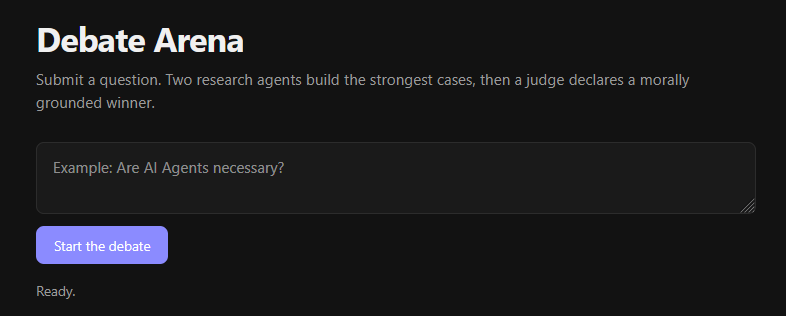
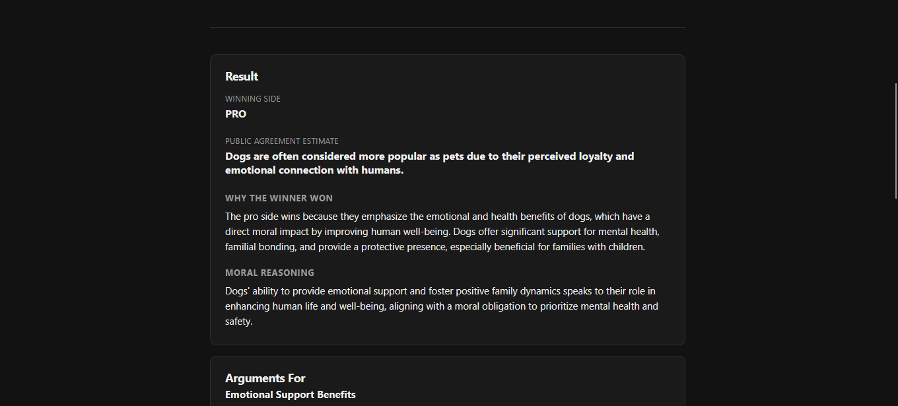

# Debate Arena

Debate Arena is a Flask web app that runs a multi-agent debate using the Backboard API. Give it a topic, and three AI agents go to work: one argues for it, one argues against it, and a judge weighs both sides and delivers a verdict — with sources.

**🔗 Try it live:** [https://debate-arena-xkpd.onrender.com/](https://debate-arena-xkpd.onrender.com/)

## How it works

Submit a debate topic, and three agents take it from there:

- **PRO AGENT** researches and argues *for* the topic, with live web search enabled.
- **CONS AGENT** researches and argues *against* the topic, with live web search enabled.
- **JUDGE** reviews both arguments and sources, then picks the stronger side.

On the first run, the app creates these three Backboard assistants and saves their IDs to `agents.json`. Later runs reuse the same assistants.

*Replace this with a screenshot of a finished debate, showing both arguments and the verdict.*

## Using the app

1. Open the [live app](https://debate-arena-xkpd.onrender.com/).
2. Type a debate topic into the input box (e.g. *"Are AI agents necessary?"*).
3. Submit, and watch the PRO and CONS agents research and argue their sides.
4. Read the judge's final verdict, along with the sources each side cited.

No installation, no terminal, no setup required — just open the link.

## Tech stack

- **Backend:** Flask (Python)
- **AI agents:** Backboard API (multi-agent orchestration + web search)
- **Hosting:** Render, served with Waitress

## About

An AI-powered debate arena using multiple agents to research both sides of a question, provide sources, and deliver a final verdict.
Built for Major League Hacking Global Hack Week: Agents
